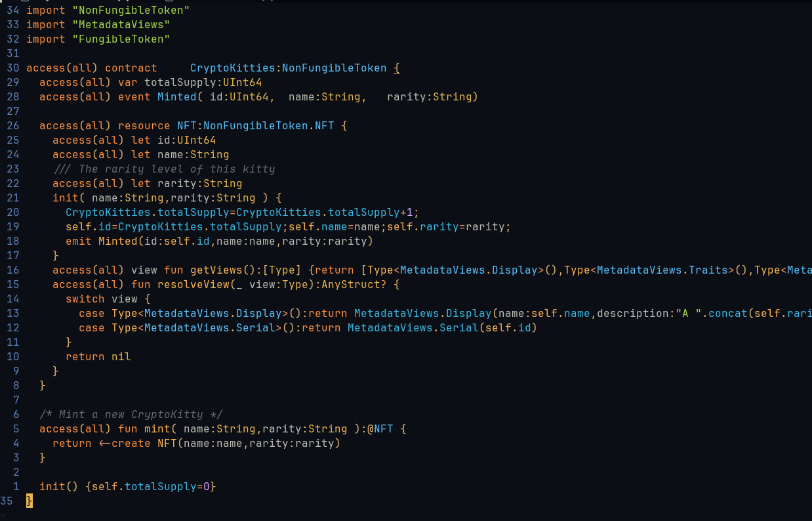
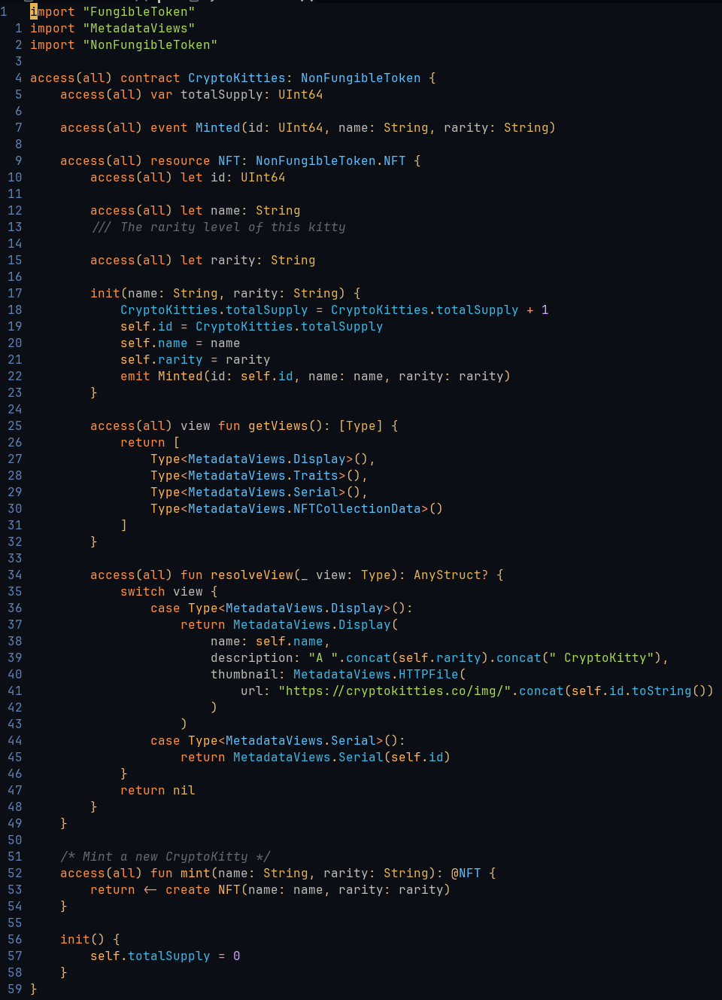

# cadencefmt

Deterministic, idempotent formatter for the [Cadence](https://cadence-lang.org/) smart contract language.

- Preserves all comments in their logical position
- Sorts imports alphabetically
- Verifies correctness via round-trip AST comparison
- Ships as a CLI (`cadencefmt`) and LSP server (`cadencefmt-lsp`)

## Example

<table>
<tr><th>Before</th><th>After</th></tr>
<tr>
<td></td>
<td></td>
</tr>
</table>

## Installation

```bash
# Go
go install github.com/janezpodhostnik/cadencefmt/cmd/cadencefmt@latest
go install github.com/janezpodhostnik/cadencefmt/cmd/cadencefmt-lsp@latest

# Nix
nix run github:janezpodhostnik/cadencefmt

# Build from source
git clone https://github.com/janezpodhostnik/cadencefmt.git
cd cadencefmt
go build ./cmd/cadencefmt
go build ./cmd/cadencefmt-lsp
```

## Usage

```bash
# Format stdin → stdout
cat MyContract.cdc | cadencefmt

# Format files in-place
cadencefmt -w MyContract.cdc

# Format a directory recursively
cadencefmt -w contracts/

# Check if files are formatted (exit 1 if not)
cadencefmt -c contracts/

# Show diff of formatting changes
cadencefmt -d MyContract.cdc

# Separate flags from paths starting with -
cadencefmt -w -- -unusual-name.cdc
```

### Flags

| Flag | Description |
|------|-------------|
| `-w`, `--write` | Write formatted output back to the file |
| `-c`, `--check` | Exit 1 if any file would change; prints changed paths |
| `-d`, `--diff` | Print unified diff instead of formatted source |
| `--no-verify` | Skip round-trip AST verification |
| `--config` | Path to config file (overrides `.cadencefmt.toml` search) |
| `--stdin-filename` | Filename for diagnostics when reading stdin |
| `-v`, `--version` | Print version and exit |

### LSP Server

`cadencefmt-lsp` speaks [LSP](https://microsoft.github.io/language-server-protocol/) over stdio and supports `textDocument/formatting`. Point your editor's generic LSP client at it.

### Exit Codes

| Code | Meaning |
|------|---------|
| 0 | Success |
| 1 | `--check`: at least one file would change |
| 2 | Usage error (bad flags, missing input) |
| 3 | Parse error in input |
| 4 | Internal error (verification failed, orphaned comments) |

## Formatting Style

Defaults (configurable via `.cadencefmt.toml`):

- 100-character line width (`line_width`, default: 100)
- 4-space indentation (`indent_character`: `" "`, `indent_count`: 4; tabs supported)
- Sorted imports (`sort_imports`, default: true)
- Stripped semicolons (`strip_semicolons`, default: true)
- At most 1 consecutive blank line (`keep_blank_lines`, default: 1)

## Configuration

Create a `.cadencefmt.toml` in your project root:

```toml
line_width = 80
indent_character = " "
indent_count = 2
sort_imports = true
strip_semicolons = true
keep_blank_lines = 1
```

The formatter searches for `.cadencefmt.toml` starting from the formatted file's directory, walking up to the filesystem root. All fields are optional — unset fields use defaults.

Use `--config <path>` to specify an explicit config file.

## Performance

Representative benchmark results formatting real-world Cadence contracts:

| Input | Time | Throughput | Allocs |
|-------|-----:|-----------:|-------:|
| Snapshots (30 files, 4.8KB total) | 1.7ms | 2.9 MB/s | 20K |
| Corpus small (<1KB, 183 files) | 42ms | 3.3 MB/s | 536K |
| Corpus medium (1–10KB, 257 files) | 114ms | 3.9 MB/s | 1.4M |
| Corpus large (>10KB, 46 files) | 219ms | 3.9 MB/s | 2.2M |
| Largest file (110KB) | 35ms | 3.1 MB/s | 312K |

> Measured on AMD Ryzen 9 3900X, Go 1.26.1, Linux. Numbers vary by hardware.
> Reproduce: `just bench-all` (requires `git submodule update --init` for corpus).

## Contributing

See [CONTRIBUTING.md](CONTRIBUTING.md) for development setup, testing, and commit conventions.

## License

[Apache-2.0](LICENSE)
